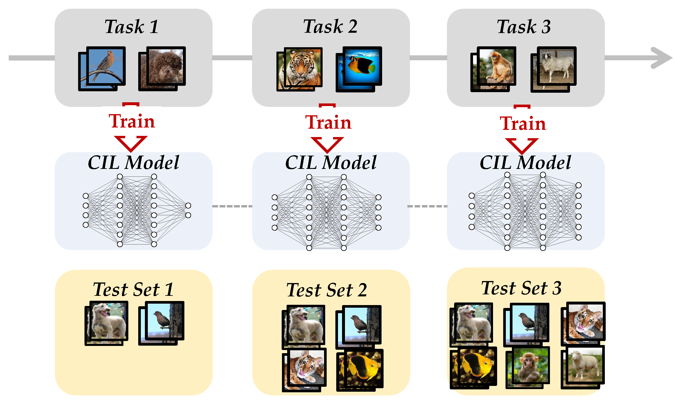
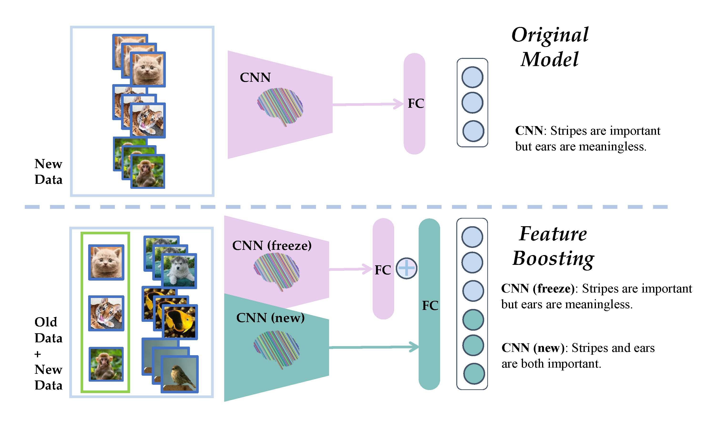
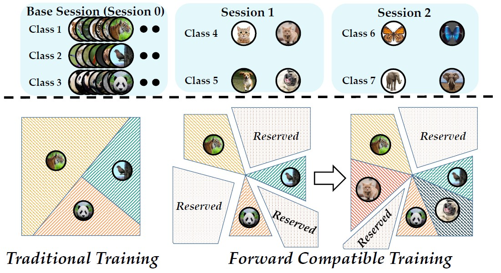

## Short Biography

I am a junior undergraduate at [Nanjing University](https://www.nju.edu.cn/en/main.psp) (NJU), majoring in computer science and artificial intelligence. I was honored to be able to join [LAMDA](https://www.lamda.nju.edu.cn/MainPage.ashx) to do research in machine learning, especially lifelong learning, under the guidance of  Professor [Han-Jia Ye](http://www.lamda.nju.edu.cn/yehj/) and Dr. [Da-Wei Zhou](http://www.lamda.nju.edu.cn/zhoudw/) in 2021 Fall.  Currently, I am looking for a 2023 Fall Ph.D. position.

## Research Interests

As a beginner in research, I have great enthusiasm and interest in various fields and am willing to be exposed to new knowledge and challenges.  I am currently working on [lifelong learning](https://en.wikipedia.org/wiki/Lifelong_learning), especially class-incremental learning, which aims to enable neural networks to learn novel classes while maintaining discrimination ability for old classes. I am also interested in [computer vision](https://en.wikipedia.org/wiki/Computer_vision) and building [intelligent agent](https://en.wikipedia.org/wiki/Intelligent_agent) systems.

## News

- **[Apr. 2022]** One paper about class-incremental learning is uploaded to [arXiv](https://arxiv.org/abs/2204.04662).
- **[Mar. 2022]** One paper about [few-shot class-incremental learning](https://arxiv.org/abs/2203.06953) is accepted to [CVPR 2022](http://cvpr2022.thecvf.com/).
- **[Dec. 2021]** A Chinese survey of class-incremental learning is submitted to [CJC](http://cjc.ict.ac.cn/).
- **[Dec. 2021]** A [toolbox](https://github.com/G-U-N/PyCIL) for class-incremental learning is released ([technical report](https://arxiv.org/abs/2112.12533)).
- **[Jun. 2021]** I join [LAMDA](https://www.lamda.nju.edu.cn/MainPage.ashx).

## Publications

### Technical Report

  

<strong>PyCIL: A Python Toolbox for Class-Incremental Learning</strong>
 
    Da-Wei Zhou, <strong>Fu-Yun Wang</strong>, Han-Jia Ye, De-Chuan Zhan
 
<em>arXiv:2112.12533 2021.</em>
  
 <a href="https://arxiv.org/abs/2112.12533" target="_blank">[arXiv]</a>
 [<a href="https://github.com/G-U-N/PyCIL">Code</a>]
 [<a href="https://box.nju.edu.cn/f/ee4cb7b69778459488be/">Poster</a>]
 [<a href="https://zhuanlan.zhihu.com/p/490308909">中文解读</a>]

 

 
### Preprints

  

  

<strong>FOSTER: Feature Boosting and Compression for
Class-Incremental Learning</strong>
 
<strong>Fu-Yun Wang</strong>, Da-Wei Zhou, Han-Jia Ye, De-Chuan Zhan
 
<em>arXiv:2204.04662. 2022. </em>
  
 <a href="https://arxiv.org/abs/2204.04662" target="_blank">[arXiv]</a>
 

  

### Conference Paper

  

<strong>Forward Compatible Few-Shot Class-Incremental Learning</strong>
 
Da-Wei Zhou, <strong>Fu-Yun Wang</strong>, Han-Jia Ye, Liang Ma, Shiliang Pu, De-Chuan Zhan
 
<em>IEEE Conference on Computer Vision and Pattern Recognition. <strong><i style="color:#1e90ff">CVPR 2022</i></strong>.</em>
  
[<a href="http://www.lamda.nju.edu.cn/zhoudw/file/CVPR22/CVPR22.pdf" target="_blank">Paper</a>] 
[<a href="http://www.lamda.nju.edu.cn/zhoudw/file/CVPR22/CVPR22_supp.pdf" target="_blank">Supplementary</a>]
[<a href="https://arxiv.org/abs/2203.06953" target="_blank">arXiv</a>]
[<a href="http://www.lamda.nju.edu.cn/zhoudw/file/CVPR22/CVPR22_project.html" target="_blank">Project Page</a>]
[<a href="https://github.com/zhoudw-zdw/CVPR22-Fact" target="_blank">Code</a>]
<!-- <strong><i style="color:#e74d3c">Oral Presentation</i></strong> -->

  

## Selected Honors

- **[2022]** [Tencent Oxpecker Research Talent Program](https://www.withzz.com/project/detail/155), the only undergraduate admitted to this program.
- **[2021]**  National Scholarship awarded by the China Ministry of Education, the highest honor in China.
- **[2020, 2021]**  Nanjing University Outstanding Student Award.
- **[2020]** Nanjing University People Scholarship.
- **[2020]** Nanjing University De-Wang Scholarship.
- **[2021]** The first prize of [the College Students Computer Design Contest, China](http://jsjds.ruc.edu.cn/).

## Correspondence

Email: wangfuyun [at] smail.nju.edu.cn
 
Address: National Key Laboratory for Novel Software Technology, Nanjing University, Xianlin Campus Mailbox 603, 163 Xianlin Avenue, Qixia District, Nanjing 210023, China
